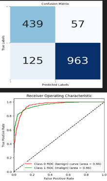
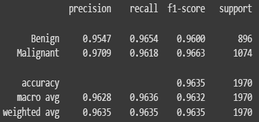
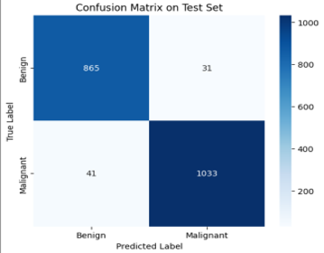
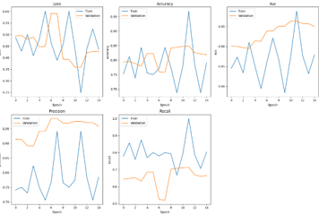

#  Breast Cancer Classification using Deep Learning

## Project Summary

Early detection of breast cancer significantly improves survival rates. This project explores the application of deep learning techniques to automatically classify breast tumor images into **benign** and **malignant** categories.

The primary goal was to design, train, and compare multiple state-of-the-art deep learning architectures to understand their effectiveness in medical image classification and identify the most reliable model for accurate diagnosis support.

---

##  Datasets Used

To ensure diverse learning, the models were trained and evaluated on three well-known medical imaging datasets:

###  BreakHis Dataset
- **Type:** Histopathology images  
- **Classes:** Benign (0) | Malignant (1)  
- **Usage:** Applied with ResNet-50 and Vision Transformer models to analyze tissue-level cancer patterns.

---

###  DDSM Dataset
- **Type:** Mammogram images  
- **Classes:** Benign (0) | Malignant (1)  
- **Usage:** Used for training CNN-based architectures including Custom VGG and EfficientNet.

---

###  INbreast Dataset
- **Type:** Mammography images  
- **Classes:** Benign (0) | Malignant (1)  
- **Usage:** Evaluated using both CNN and transformer-based approaches for comparative analysis.

> Due to large file sizes, datasets are not included in this repository. Download links are provided separately.

---

##  Data Preparation & Processing

Key preprocessing steps performed:

- Image resizing and normalization
- Data augmentation to improve generalization
- Handling class imbalance using class weights
- Training–validation split for performance evaluation
- Early stopping to prevent overfitting

These steps played a crucial role in improving model stability and accuracy.

---

##  Deep Learning Models Implemented

###  ResNet-50 (Transfer Learning)
A pretrained convolutional network fine-tuned for binary classification.

**Observation:**  
High training accuracy but noticeable overfitting during validation.

---

###  EfficientNetB3
A lightweight yet powerful architecture optimized for feature extraction.

**Observation:**  
Strong training performance with some limitations in generalizing to unseen data.

---

###  Vision Transformer (ViT)
An attention-based architecture that learns global relationships within images using patch embeddings.

**Performance Achieved:**
- **Accuracy:** 88.51%
- **F1 Score:** 0.87

This model delivered the best overall classification performance among all approaches.

---

###  Custom VGG-Based CNN
A tailored CNN architecture incorporating dropout, batch normalization, and regularization techniques.

**Observation:**  
Consistent and stable performance across both training and validation datasets.

---

##  Results & Model Performance

###  Vision Transformer — Best Performing Model

  

  

---

###   ResNet-50 Results

  

  

---

###  Custom VGG Results

  

  

---

###  EfficientNet Results

  

---

###  EfficientNet Results

  

---

##  Performance Comparison

| Model | Key Insight |
|------|-------------|
| ResNet-50 | Overfitting observed |
| EfficientNetB3 | High training accuracy |
| Vision Transformer | Highest accuracy & best generalization |
| Custom VGG | Stable and reliable performance |

---

##  Technologies & Tools

Python • TensorFlow • Keras • OpenCV • NumPy • Pandas • Matplotlib • Scikit-learn

---

##  Key Takeaways

- Deep learning models can effectively classify breast cancer from medical imaging data.
- Transformer-based architectures demonstrated superior ability in capturing complex visual patterns.
- Proper preprocessing and augmentation significantly improved model performance.
- Comparative evaluation helped identify the most reliable architecture for medical diagnosis support.

---

##  Author

**Khushi Tyagi**  
B.Tech — Data Science
