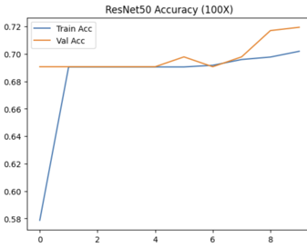

# Breast Cancer Classification using Deep Learning

## Project Overview

This project focuses on early detection of breast cancer using deep learning models to classify medical images into **Benign** and **Malignant** categories.

Multiple state-of-the-art architectures were implemented and compared to identify the most accurate and reliable model for medical image classification.

---

## Datasets Used

- **BreakHis:** Histopathology images  
- **DDSM:** Mammogram images  
- **INbreast:** Mammography dataset  

> Datasets are not included due to large size.

---

## Data Processing Steps

- Image resizing & normalization  
- Data augmentation  
- Handling class imbalance  
- Train–validation split  
- Early stopping to prevent overfitting  

---

## Models Implemented

- **ResNet-50:** High accuracy but overfitting observed  
- **EfficientNetB3:** Strong feature extraction performance  
- **Vision Transformer (ViT):** Best performing model  
- **Custom VGG CNN:** Stable and consistent results  

**Best Model Performance (ViT):**
- Accuracy: **88.51%**
- F1 Score: **0.87**

---

## Results

### Vision Transformer

  

---

### ResNet-50

  

---

### Custom VGG

  

---

### EfficientNet

  

---

## Tech Stack

**Python • TensorFlow • Keras • OpenCV • NumPy • Pandas • Matplotlib • Scikit-learn**

---

## Key Takeaways

- Deep learning can effectively classify breast cancer from medical images.  
- Vision Transformer showed best accuracy and generalization.  
- Proper preprocessing significantly improved performance.

---

## Author

**Khushi Tyagi**  
B.Tech — Data Science
